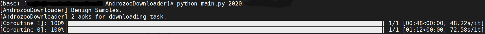

本来用官方推荐的[azoo](https://github.com/ArtemKushnerov/az)下载，但时间过滤和性能等方面都有些不满意的地方，冗余也有点多，所以自己写了这个脚本。

主要需求是按年份和 VirusTotal 扫描结果来下载良性/恶意样本，支持：

- 代理（`config`文件中指定http代理的IP和端口）
- 协程（设置`--coroutine`为协程数量，默认20个，参考`Feel free to use up to ~20 concurrent downloads (40 if you're outside Europe)`），且每个协程提供进度条
- 断点处继续（设置`--update`为True）

另外，脚本通过[获取流式响应](https://docs.aiohttp.org/en/stable/client_quickstart.html#streaming-response-content)节省内存，会在错误处重试，生成充足的日志记录（`.log`文件是程序日志，`.txt`是已下载apk的实时记录，文件名均表示为`year_(B)/(M_vt)_timestamp`）；可以设置每个年份的下载数量上限，以及应用商店的过滤（默认'play.google.com', 'anzhi', 'appchina'，论文中称这三个为Main Markets），更多参数见[文末](#Optional parameters)。

</img>

下面我就用英文写了噢QAQ

### Get Started

Thanks to [**Androzoo**](https://androzoo.uni.lu/), we can get access to a large dataset.

First, request an API key. 

> Please send an application email to **androzoo@uni.lu** stating the name of your research institution and the name of the person requesting access. Make sure to send your application from your university (or research institution) email account.

Second, download the csv for the descriptions of the whole dataset.

```shell
$ wget https://androzoo.uni.lu/static/lists/latest.csv.gz
```

- `sha256`, `sha1`, `md5`, `apk_size`: Those are what you think they are.

- `dex_size`: The size of the classes.dex file (i.e., ignoring all other dex files)

- `dex_date`: The date attached to the dex file inside the zip (sometimes invalid and/or manipulated)

  > WARNING: the dex_date is mostly unusable nowadays: The vast majority of apps from Google Play have a 1980 dex_date

- `pkg_name`, `vercode`: the name of the android Package and the version code (as reported in the manifest file). 

  > Note: pkg_name might be unique inside one market (i.e. two apks with the same pkg_name inside google play may have the same developer).

  > WARNING: There is one bogus APK (BC564D52C6E79E1676C19D9602B1359A33B8714A1DC5FCB8ED602209D0B70266) whose pkg_name contains a ",". Use `grep -v ',snaggamea'` to get rid of it.

- `vt_detection`,`vt_scan_date`: The number of AV from VirusTotal (VT) that detected this apks as a malware on vt_scan_date (if available)

- `markets`: a '|' separated list of the markets where we saw this APK.

  > Note: The absence of a market does NOT mean that an APK was not published on this market. It means we did not see it there.

### Add a `config` file

```
{
    "key": <require>,
    "meta": <require, default:"~/latest.csv">,
    "proxy": <optional>,
    "port": <optional>
}
```

> 亲测用一个香港服务器节点做代理，速度会快很多（原因你懂的）

### Run the script

The script aims to download apks for one year (according to the dex_date). If you want to download apks in 2019, you can simply run the script as follows:

```shell
$ python main.py 2019
```

#### Optional parameters:

```
'--update': type=bool, default=False, help='Ignore the downloaded (sha256 recorded in <year>_<timestamp>.txt).'
'--max': type=int, default=104000, help='Max number of apks to download.'
'--coroutine': type=int, default=20, help='Number of coroutines.'
'--markets': nargs='+', default=['play.google.com', 'anzhi', 'appchina'], help='Number of coroutines.'
'--vt_detection': type=int, default=0, help='Download Benign apks by default. Lower bound (included) of `Malware` if greater than 0.'
'--upper': type=int, help='Upper bound (not included) for `Malware`. Useful only if vt_detection is greater than 0.'
'--output': type=str, default='data1', help='Save apks in /<output>/Androzoo/<Benign or Malware>/<year>.'
'--debug': type=bool, default=False, help='Logging level: INFO by default, DEBUG will log for every apk in both stdout and file.'
'--fix', type=bool, default=False, help='Just remove the broken apks since last stop.'
'--config', type=str, default='config', help='Sepecify the name for config file.'
```
